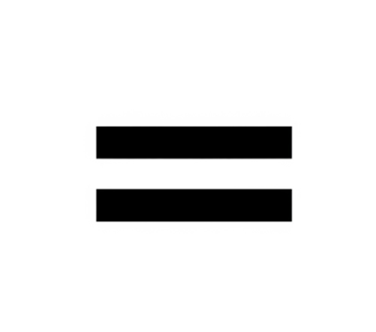

# 02. 변수와 자료형

### 변수 (Variable)

**자료값**을 저장하는 공간 


>💡데이터라는 물건을 담는 **상자**


### 자료형 (Data Type)

자료의 종류 (정수, 소수, 문자, 문자열 등)


>💡물건을 담는 **상자의 종류**


### 변수의 3요소

- 이름 (Name)
- 자료형 (Data type)
- 자료값 (Data)

### **대입연산자 (Assignment Operator)**



```cpp
int a; 

a = 5; 
a = 10;

int b;
b = 3.14 

```

수학적 의미의 ‘**같다**’가 아닌 우측 값을 좌측 변수로 ‘**대입한다**’는 의미

### 변수 선언

변수를 사용하기 위해 **변수 선언**(Variable declaration)이 필수

```cpp
//정수 자료형
int i;

//소수 자료형
double d;
float f;

```

### 변수 초기화

변수를 선언한 뒤 초기화를 진행하지 않으면, 예상치 못한 **쓰레기값**이 저장될 수 있음.

>**💡쓰레기값 (Garbage value)**
    ì´ˆê¸°í™” 하지 않은 변수에 저장
이전에 사용했던 프로그램이 남긴 무의미한 값
    ë¬´ì‘위 값이 저장됨
쓰레기값을 참조할 경우 예기치 못한 에러가 발생할 수 있음


### 변수 여러개 선언

```cpp
int a,b ;

int a; 
int b;

int a = 0; 
int b = 0;

int a = 0, b = 0;

```

```c
int year = 1998, month = 11, date = 6;
printf("나의 생일은 %d년 %d월 %d일 입니다.\n", year, month, date);
```

**변수 중복 선언 불가**

```c
int a = 0;
int a = 5;
```

**변수 스왑(Swap)**

```c

int a = 1, b = 3;

a = b // a 값은 어디로?

```

```c

int a = 1, b = 3;

int t;

t = a; //a 값 임시저장

a = b; //b 값을 a에 대입
b = t; //c에 있는 a값을 b에 대입
```

### 상수

한 번 초기화 한 뒤, **다시는 수정할 수 없는 변수**

키워드 const 사용

```cpp
const int a = 5;

...

a = 30; // Error !
```